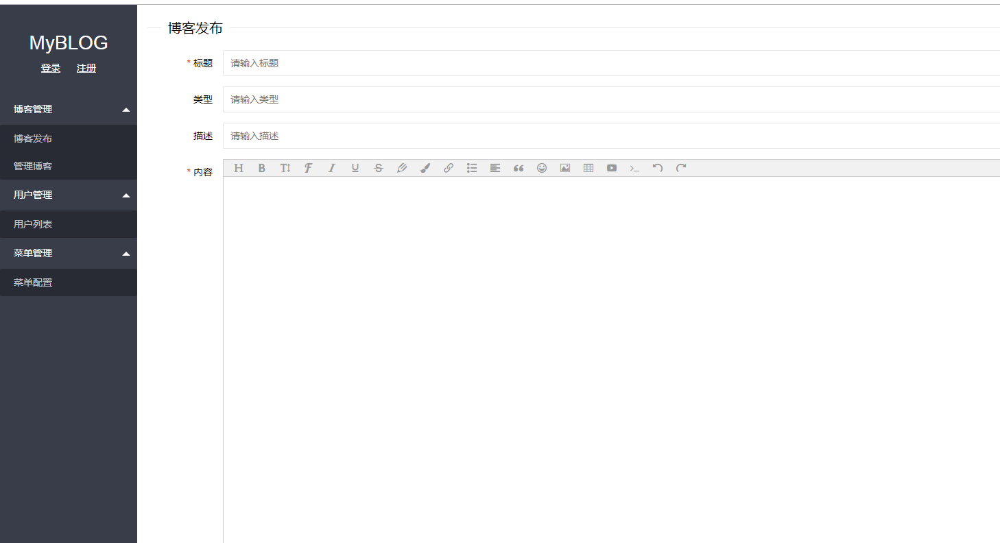
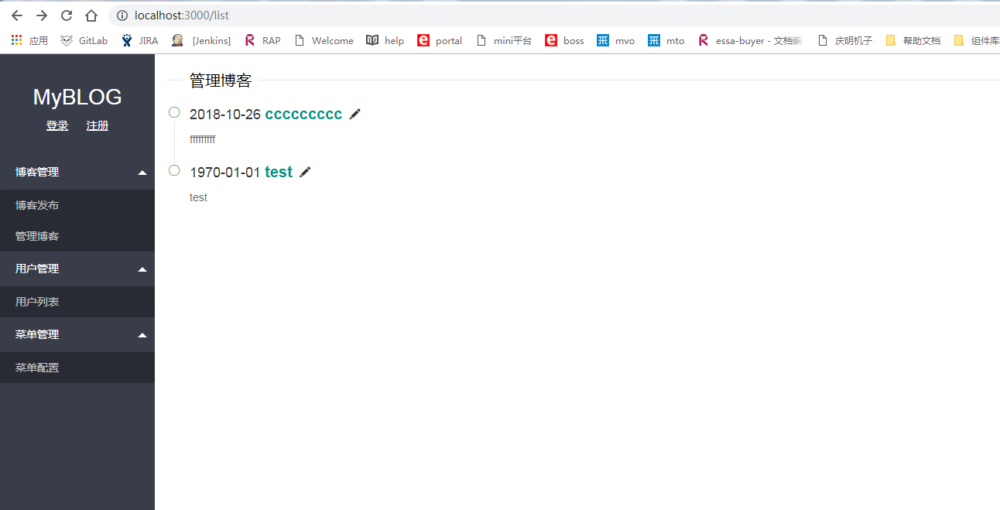
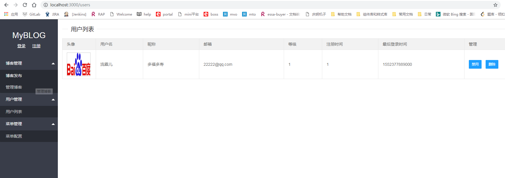

# blog-management 博文发布

环境准备：node,mongodb
数据库设计e-r图：https://blog.csdn.net/github_39570717/article/details/83382226

### 安装
> npm install

### 编译js
> npm run build

### 启动
> npm run start 

### 访问
> 地址栏输入：localhost:3000

### 效果如下：
  
 
 
 

